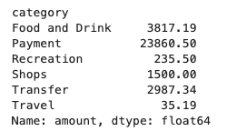
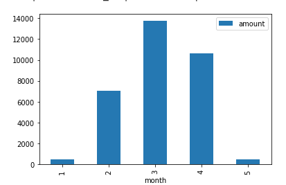
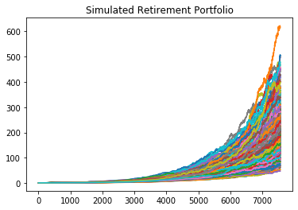
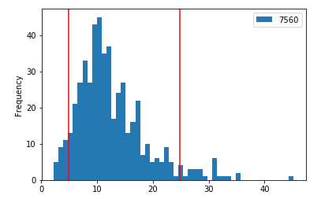
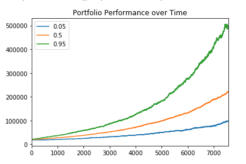

# Financial Report

## Budget Analysis

### A Summary  of the transaction data from the budget analysis.

This pie chart illustrates dollar amounts per category

This bar chart illustrates how many transactions were made per category

This table illustrates monthly spending

## Retirement Planning

### A summary of the retirement portfolio anaylsis 

Based on a 60/40 split of SPDR S&P 500 ETF Trust(SPY) and iShares Core US Aggregate Bond ETF (AGG), below is a 30 year simulation (based on volatility and past performance) of how your portfolio could perform.

Monte Carlo Similation

This portfolio's cumulative returns will fall within these bounds (Assuming a 90% confidence level)

Cumulative Returns

The expected portfolio returns in 30 years broken down into the 10th, 50th or 90th percentile would be:

10th percentile => $710,859.31
50th percentile => $1,166,943.81
90th percentile => $1,812,723.93